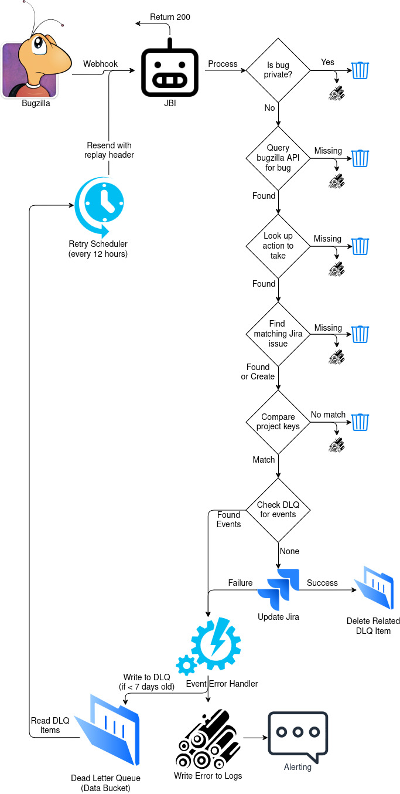

# Bugzilla disables webhooks after too many errors

- Status: accepted
- Date: 2023-11-27

Tracking issues: 
- [21 - Setting up Webhooks with 'ANY' Product](https://github.com/mozilla/jira-bugzilla-integration/issues/21)
- [82 - Exception in JBI can delay webhook delivery](https://github.com/mozilla/jira-bugzilla-integration/issues/82)
- [181 - Can we ping Bugzilla to see if the webhook is enabled?](https://github.com/mozilla/jira-bugzilla-integration/issues/181)
- [710 - System is able to "drop" erring messages without user interference](https://github.com/mozilla/jira-bugzilla-integration/issues/710)
- [730 - Establish convention for capturing system incidents](https://github.com/mozilla/jira-bugzilla-integration/issues/730)
- [743 - Create alerts for when bugs fail to sync](https://github.com/mozilla/jira-bugzilla-integration/issues/743)

## Context and Problem Statement
When Bugzilla receives too many error responses from JBI, it stops triggering webhook calls for the entire project causing data to stop syncing. Frequently, these errors are due to a configuration error in Jira or Bugzilla. JBI being unable to process a payload due to errors in configuration (or incomplete configuration) in Jira or a mismatch of data for a single bug. These outages can last multiple days in some cases.

We don't want the entire sync process to stop because of this. We have identified four options to solve this problem.

## Decision Drivers
- Amount of initial engineering effort
- Amount of maintenance effort
- Overall performance of JBI (how quickly is data able to move)
- How intuitive the solution is to the users that depend on the data (will picking the easiest option solve their needs?)

## Proposed Solution
We propose to use a file share (or a data bucket) as a dead-letter-queue. Events will attempt to be reprocessed every 12 hours for up to 7 days. After which they will be dropped. Errors will be logged for each event that cannot be processed. Alerts can be triggered based on this to let Jira and Bugzilla admins know there is a problem.

See the diagram below for a detailed flow of data. Note: This is designed to show the flow of data, not be representative of coding patterns or infrastructure.

![Image detailing the bucket data structure. DLQ bucket > folders with names like project-bug_id > json files with names like action-[id-]timestamp.json](./003-bucket.drawio.jpg "Proposed Solution Flow Chart")

  
Breakdown of flowchart

  1. JBI receives a payload from Bugzilla or the Retry Scheduler.
  1. JBI will always return 200/OK for a response.
  1. If the bug is private, discard the event and log why.
  1. If the bug cannot be found in the Bugzilla API, discard the event and log why.
  1. If an associated action cannot be found for the event, discard the event and log why.
  1. If a matching Jira issue cannot be found, and the event is not creating one, discard the event and log why.
  1. If there is a mismatch between project keys in the event and Jira, discard the event and log why.
  1. If there is already an event for this bug in the DLQ, do not try to process this event and skip to the Error Event Handler.
  1. Write updated data to Jira's API.
      1. If successful, delete any associated items in DLQ.
      1. If error is returned, continue to Error Event Handler
  1. Handle errors in Error Event Handler
      1. Write an error to the logs, which may be forwarded to an alerting mechanism.
      1. Write an updated event file to the DLQ if the original event is less than 7 days old.
      1. If we have exceeded 7 days from the original event, delete associated DLQ items.
  1. The retry scheduler runs every 12 hours and will re-send events to JBI. Oldest events will be processed first. An additional parameter will be provided that notes these are events to reprocess.

### Pros:
 - Avoids the problem of accidentally overwriting newer data with older data
 - Avoids making users correct data manually if something is misconfigured
 - Gives users a whole work week to update potentially misconfigured settings
 - Low maintenance effort
 - Mid-low engineering effort
 - High performance of JBI
 - Intuitive solution with alerting via error logs

### Cons:
 - Additional infrastructure for the DLQ file share or data bucket
 - Events will wait up to 12 hours to be reprocessed

### Notes:
 - This relies on using the ``last_change_time`` property from Bugzilla webhook payloads.
 - Also relies on checking the ``issue.comment.updated`` and ``updated`` properties in the Jira API.
 - This will cause a bit more latency in event processing, but nothing noticeable to users.
 - This will cause more API calls to Jira. We should consider rate limits.

## Considered Options
For all of these options, we will be returning a successful 200 response to Bugzilla's webhook calls. Note: we have to return a 200 because of Bugzilla's webhook functionality (they check for 200 specifically, not just any OK response).

### Option 1: Log the failure and move on
JBI will log that we couldn't process a specific payload, along with relevant ID's (bug id, Jira issue id, comment id, etc) so further investigation can be done if needed.

**Decision Drivers**
- Amount of initial engineering effort: very low
- Amount of maintenance effort: very low
- Overall performance of JBI: high
- How intuitive the solution: low - users will notice data is missing but see status pages that look green

**Pros:**
- The simplest solution

**Cons:**
- Will not alert people to data loss (without additional alerting functionality)
- Still requires engineers to investigate further if needed

### Option 2: Ask a human to do something
JBI will alert users that data could not be synced. This could happen through an IM alert or an email immediately, or a scheduled (daily?) report, or by creating a well-formed log that an alerting workflow picks up. We should know which users to identify based on project configuration in Bugzilla or a distribution list if doing an IM or email directly.

**Decision Drivers**
- Amount of initial engineering effort: low
- Amount of maintenance effort: low
- Overall performance of JBI: high
- How intuitive the solution: high

**Pros:**
- Removes need for engineering to investigate
- Alerts users directly that there is a problem

**Cons:**
- Alerts can be noisy and cause notification fatigue

### Option 3: Queue retries internally
Create a persistence layer within the JBI containers that will queue and retry jobs for a specific length (2 hours? 2 days?) of time. This could be done with an internal cache (redis) or database (postgres) within the container. After retries exceed the max time length, an error would be logged and the data would be dropped.

**Decision Drivers**
- Amount of initial engineering effort: high, creating more complex containers
- Amount of maintenance effort: moderate, increased complexity of testing and debugging
- Overall performance of JBI: high
- How intuitive the solution: low - users will notice data is missing but see status pages that look green

**Pros:**
- Allows for retries up to a designated amount of time
- Keeping all services within the container make end-to-end testing and debugging easier (compared to option 4)

**Cons:**
- Increases complexity of the containers
- Data will not persist container restarts
- High effort for engineers to build and maintain
- Less intuitive to users and engineers, we would need to report on cache/queue metrics to logs
- Data could be processed out of order, causing newer updates to get lost

### Option 4: Use a simple DLQ (dead letter queue)
We would always return 200, but any events that fail to process internally would get sent to a DLQ and be replayed later if needed. This could be a storage bucket, kubernetes volume, or table in a database. A scheduled kubernetes job would then run to try and pick these up and reprocess them later (every 4 hours, for example). 

After too many failed attempts the payload would be marked as unprocessable (setting a flag in the table, or updating the file name).

**Decision Drivers**
- Amount of initial engineering effort: mid, minimal added infrastructure (database/table or k8s volume or storage bucket)
- Amount of maintenance effort: mid-low (mid if we spin up a new database)
- Overall performance of JBI: high
- How intuitive the solution: high to engineers, low to users

**Pros:**
- Durable and expandable solution
- Does not reduce JBI throughput
- Intuitive to engineers

**Cons:**
- Added infrastructure
- Not intuitive to end users unless we build additional reporting so they know why an update didn't come over
- Data could be processed out of order, causing newer updates to get lost

### Option 5: Use a dedicated queue solution
We would have a dedicated service that accepts all API calls from Bugzilla and puts them into a queue (apache kafka, rabbitMQ, etc). JBI would shift to being a downstream service and process these events asynchronously. Any events that fail to process would get sent to a DLQ (dead letter queue) that could be replayed later if needed.

There are plenty of existing solutions we could use to solve this problem from a technical perspective. A separate ADR would be done to identify the best answer if we choose to go this route.

**Decision Drivers**
- Amount of initial engineering effort: high, building out more infrastructure
- Amount of maintenance effort: high, maintaining more infrastructure
- Overall performance of JBI: highest, event driven
- How intuitive the solution: high - we'll have reporting on queue metrics

**Pros:**
- Most durable solution
- Does not reduce JBI throughput
- Intuitive to users and engineers, we can see and report on data in queue

**Cons:**
- Most complex solution
- Highest effort for engineers to build and maintain

### Option 6: A combination of the above
Example: We could create a simple DLQ (a table in postgres) external queue for re-processing and then alert users if the DLQ grows too quickly.

### Miscellaneous options that we thought about
- Using a postgres or redis server to store data. This would mean another server to maintain and coordinate maintenance downtime.
- Using a sqlite (or similar) file to store data. This doesn't work well in a scalable solution that will have multiple pods and threads running.
- Using a queue (kafka, pub/sub, etc) but only as the DLQ and not as a work queue. There is a chance for data to be processed out of order with this approach if events come in too quickly.

## Links 
- [What is event streaming?](https://kafka.apache.org/documentation/#intro_streaming) - Documentation from Apache Kafka
